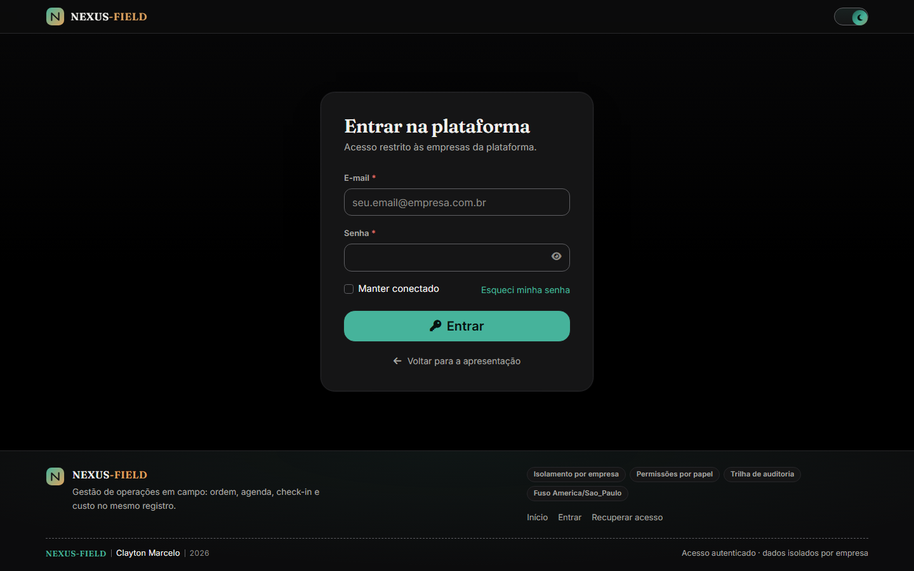
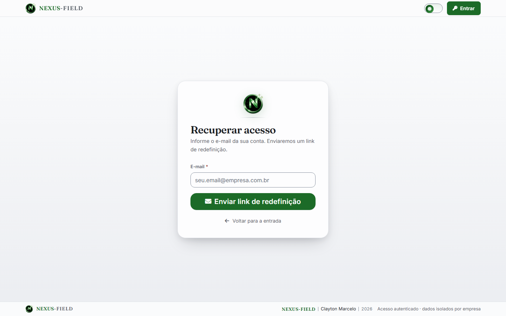
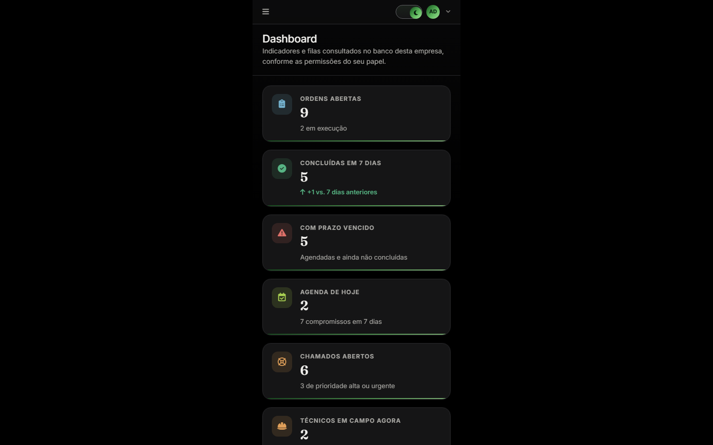
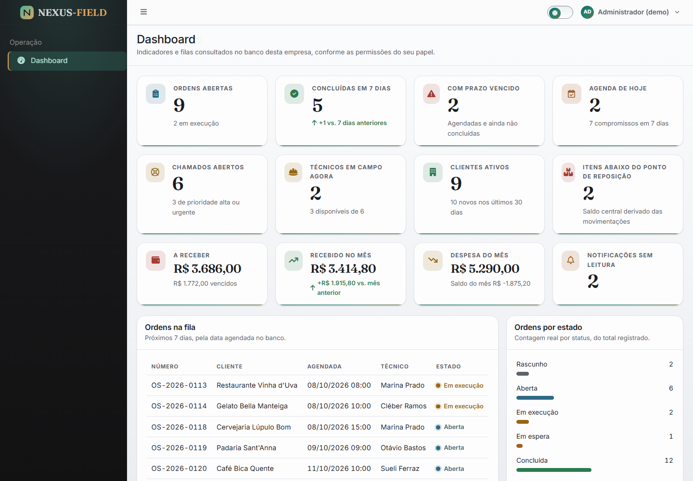
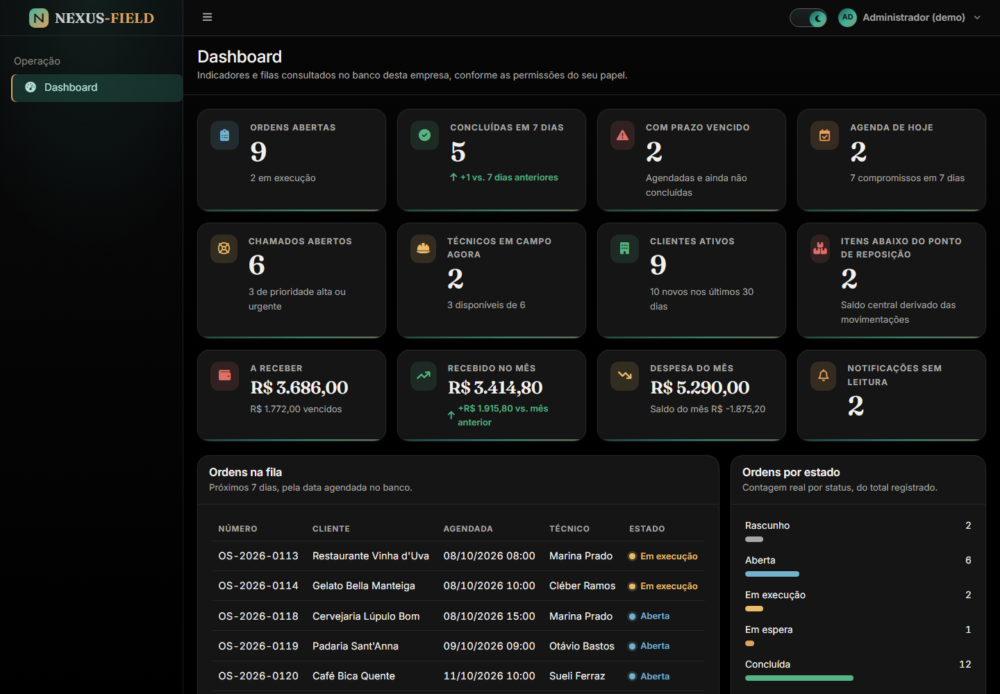

<p align="center">
  
</p>

<h1 align="center">NEXUS-FIELD</h1>

<p align="center">
  <strong>Field Service Management — a operação externa inteira em um só lugar</strong><br>
  Plataforma multiempresa para gerenciar clientes, ordens de serviço, chamados, agenda, check-in em
  campo com geolocalização, estoque, financeiro, relatórios e auditoria no mesmo painel.
</p>

<p align="center">
  
  
  
  
  
  
  
  
</p>

<p align="center">
  <sub>Estágio atual: fundação completa (fases 1 a 8), os cadastros e o catálogo no ar
  (fase 9 — clientes, fase 10 — técnicos, equipes e especialidades, fase 11 — serviços, produtos e
  categorias) e a operação aberta (fase 12 — ordens de serviço, fase 13 — chamados, fase 14 — agenda
  em calendário, fase 15 — visita de campo com posição, fase 16 — estoque em livro-caixa). A tabela
  <a href="#módulos">Módulos</a> diz, um por um, o que já está no ar e
  o que ainda é só schema.</sub>
</p>

---

## Telas

Capturas do aplicativo rodando (Laravel + AdminLTE 4 sobre MySQL), nos dois temas e em celular, todas
no mesmo quadro de **1440×900**, duas por linha e na mesma escala de exibição. Cada imagem é um link:
o clique abre o arquivo no tamanho capturado. O painel de celular é fotografado no viewport real dele
(390×844) e montado sobre o mesmo quadro de 1440×900 — é o único quadro diferente da série, e a
legenda diz isso. Os painéis mostram a empresa de demonstração criada pelo `DemoSeeder` — é ela que
tem ordens, chamados, financeiro e estoque para os indicadores calcularem; na empresa real sem dados,
os mesmos blocos aparecem nos estados vazios. As três capturas do painel são anteriores à fase 16:
desenham doze indicadores e hoje o escritório conta treze, porque o estoque acrescentou o cartão
"Movimentações de hoje" e a lista "Últimas movimentações". Elas serão recapturadas quando a última
fase pousar — o painel ganha um bloco por módulo, e refazer a foto a cada fase manteria o README
mentindo uma fase por vez.

<div align="center">

| Apresentação pública · tema claro | Entrada · tema escuro |
| :--: | :--: |
| <a href="docs/screenshots/01-boas-vindas.png"></a> | <a href="docs/screenshots/02-entrada.png"></a> |

| Recuperação de acesso · tema claro | Painel no celular · tema escuro |
| :--: | :--: |
| <a href="docs/screenshots/03-recuperar-acesso.png"></a> | <a href="docs/screenshots/06-painel-celular.png"></a> |

| Painel operacional · tema claro | Painel operacional · tema escuro |
| :--: | :--: |
| <a href="docs/screenshots/04-painel-claro.png"></a> | <a href="docs/screenshots/05-painel-escuro.png"></a> |

</div>

---

## Sobre o projeto

O **NEXUS-FIELD** é uma plataforma FSM (Field Service Management): ela acompanha o serviço que
acontece fora da empresa, do chamado aberto até a assinatura do cliente no encerramento.

### Problema que resolve

Operação de campo costuma viver espalhada: a agenda em uma planilha, o cliente em outra, o técnico
no grupo de mensagens e a ordem de serviço em um documento anexado. O resultado é retrabalho,
histórico que não fecha e nenhum indicador confiável no fim do mês.

O NEXUS-FIELD centraliza essa cadeia em um fluxo só — cliente → ordem de serviço → chamado →
agenda → execução em campo com check-in e check-out geolocalizado → financeiro → relatório — com
cada etapa autorizada por permissão verificada no servidor e registrada em auditoria.

### Para quem

- Assistências técnicas e empresas de instalação e manutenção
- Field service de telecom, energia, refrigeração e TI
- Equipes de campo com ordens de serviço, SLA e visita agendada
- Operadoras que precisam medir custo, tempo e produtividade por técnico

### O que a plataforma entrega

- **Rastreabilidade**: cada estado de ordem de serviço e de chamado fica registrado com autor e data
- **Autorização real**: o servidor recusa antes de qualquer botão existir na tela
- **Multiempresa de verdade**: isolamento por empresa em toda consulta, não por convenção de tela
- **Indicador sem número inventado**: todo KPI do painel sai de uma contagem no MySQL daquela empresa
- **Interface nos dois temas**: claro e escuro, com a escolha persistida no navegador e no servidor

---

## Funcionalidades no ar

São as telas e regras que existem hoje no repositório. O que ainda não está aqui está listado em
[Módulos](#módulos) e no [Roadmap](#roadmap), com a fase em que chega.

### Autenticação

- Login com e-mail e senha, hash bcrypt e custo definido em `BCRYPT_ROUNDS`
- Sessão persistida em banco, com troca do identificador após entrar (contra session fixation)
- Bloqueio de usuário inativo e de empresa com assinatura vencida
- Limite de 5 tentativas por e-mail e IP, e throttle de 10 requests/min na rota de entrada
- Recuperação de acesso pelo password broker do framework: token de uso único, expiração própria e
  senha nova com no mínimo 10 caracteres, letras e números
- Botão de revelar senha em todo campo de senha, inclusive na redefinição

### Autorização e papéis

- Catálogo único de permissões (`PermissionCatalog`) com 17 módulos e ações por módulo
- Cinco papéis de sistema sincronizados pelo seeder: Administrador, Supervisor, Funcionário,
  Técnico e Cliente
- `User::hasPermission` com cache por request e middleware `permission`, que responde 403 no servidor
- Menu montado a partir da permissão: item sem rota ou sem permissão não é desenhado

### Multiempresa

- `TenantContext` por request, middleware `ResolveCompany`, escopo global `CompanyScope` e o trait
  `BelongsToCompany`
- `anyCompany()` fura o escopo só quando o próprio código restringe pela empresa do request: o único uso
  é `CompanySetting::valueFor()`, e a linha seguinte filtra pelo `company_id` de quem está logado. Tela
  nenhuma enxerga fora da própria empresa

### Painel

- Doze indicadores contados no banco da empresa logada, mais a fila de ordens da semana e a
  distribuição por estado
- Estados de interface reais: carregando, vazio, sem permissão e erro
- `DemoSeeder` local, que grava a demonstração numa empresa separada (`nexusfield-demo`) e recusa produção

### Cadastros

- **Clientes**: lista com busca, situação e cidade, paginação própria e exportação CSV; ficha com
  contatos e endereços cadastrados em linha; exclusão lógica com restauração, e o servidor recusa
  excluir quem já gerou ordem, chamado ou lançamento
- **Técnicos**: escala com busca, situação, região e especialidade; ficha com especialidades, equipes
  (com data de entrada e de saída), base de trabalho com endereços e os últimos check-ins medidos em
  campo, contados na tabela de check-in
- **Equipes**: quadro com líder, entrada e saída de membro gravadas na tabela intermediária — a
  passagem anterior continua histórica —, as ordens que a equipe tem em aberto e exclusão só permitida
  com quadro vazio
- **Especialidades**: catálogo com o tanto de técnico que cada uma cobre; o slug nasce do nome e a
  exclusão é recusada enquanto houver alguém usando-a
- Endereço é relação polimórfica compartilhada (`TemEnderecos`): cliente e técnico têm o mesmo
  formulário, o mesmo ciclo de vida e a mesma regra de endereço principal único
- As três telas de lista passam pelos mesmos `ListFilters`, pela mesma paginação própria e pelos mesmos
  estados desenhados de vazio e de nenhum resultado com estes filtros

### Catálogo

- **Serviços**: preço e duração estimada por linha do catálogo; a ficha mostra onde o serviço já foi
  aberto como ordem e já foi cobrado como item, contado no banco, e é essa soma que segura a exclusão
- **Produtos**: SKU único por empresa, unidade vinda do catálogo do projeto e saldo que ninguém digita —
  ele é a subquery que soma as movimentações com o sinal de cada tipo (`StockMovement::CENTRAL_SIGN`),
  então consumo não mexe no estoque central e ajuste de inventário pode baixar
- **Categorias de serviço**: agrupamento que a listagem de serviços usa como filtro; o slug nasce do
  nome e a exclusão é recusada enquanto houver serviço no grupo
- Nome de serviço, SKU e slug são únicos **dentro da empresa**, não no banco inteiro — a mesma regra de
  tenant que vale para cliente e técnico
- Serviço e produto com histórico não somem: inativar tira da escolha e preserva o preço praticado;
  excluir só é permitido quando a contagem do banco dá zero

### Operação

- **Ordens de serviço**: numeração anual sequencial por empresa (`OS-2026-0007`), gerada no banco — ninguém
  digita número, e a empresa ao lado tem a sequência dela
- Criar ordem copia o endereço do cliente para a ficha e o fim previsto vem da duração estimada do serviço;
  depois disso a ordem é o documento daquele dia, e mudar o cadastro do cliente não reescreve ordem antiga
- Estado só muda pelo botão da ficha, que grava origem, destino, quem fez e quando em
  `service_order_status_history`; o fluxo (`FLUXO`) é o que vale — pular de rascunho para concluída não passa,
  e cancelar sem motivo registrado é recusado
- Abrir ordem do rascunho e cancelar pedem `orders.approve`; executar é de quem está em campo; exportar é do
  escritório. O servidor responde 403 antes de qualquer botão escondido
- Linhas cobradas são congeladas: descrição, quantidade, valor unitário e desconto ficam na ordem, então o
  catálogo pode mudar de preço depois sem reescrever a conta. A linha é serviço **ou** produto, nunca os dois
- Total, bruto e descontos saem de subconsultas do MySQL (`withTotals`), não de soma em PHP — a listagem, a
  ficha e o CSV mostram o mesmo número porque é a mesma consulta
- Quadro de comissão registra quem apoiou a ordem com data e nota; a saída libera o vínculo preservando a
  passagem, e assumir a responsabilidade troca o técnico da ordem sem perder o histórico
- O painel e a listagem respeitam o alcance: o técnico conta a própria fila, a conta de cliente conta a
  carteira dela (por `users.client_id`), e só o escritório responde pela empresa inteira
- Ordem encerrada é conta fechada: linha, quadro e estado não aceitam mudança, e a única exclusão permitida é
  a do rascunho que nunca virou trabalho
- **Chamados**: protocolo `CH-2026-0007` gerado no banco pela sequência do ano da empresa — a mesma regra
  da ordem, com o `max()` dentro de transação para dois chamados simultâneos não colidirem
- A prioridade não é enfeite: ela define o prazo em horas (`PRAZO_HORAS`), o painel calcula
  `prazo_em` na gravação, e "atrasados" é o prazo vencido sobre um estado que ainda não encerrou —
  nada de coluna de SLA digitada
- O relato e a resposta entram por Summernote e viram HTML no banco. `TextoSeguro` poda por lista fechada:
  tag e atributo que não estão na lista somem, `javascript:`/`#`/relativo não são link aceito, `<script>`,
  ``, `<iframe>` e companhia caem com o que têm dentro, e link que sobrevive ganha `noopener nofollow`
- Estado só anda pelo botão da ficha, que escreve origem, destino, autor, hora e nota em
  `ticket_status_history`; o fluxo (`FLUXO`) é o que vale, resolver sem dizer o que foi feito é recusado,
  e fechar um resolvido dispensa a frase porque a resolução já está na ficha
- Conduzir o estado é `tickets.execute`; resolver e fechar pedem ainda `tickets.close`. A conta de cliente
  lê a própria carteira e responde na conversa, mas não move estado nenhum — o servidor recusa antes da tela
- Nota interna existe para o escritório pensar sem vazar: `is_internal` só é aceito de quem tem
  `tickets.update`, e a consulta da ficha de quem não tem simplesmente deixa essas notas fora do resultado
- Reabrir limpa o carimbo de resolução, o prazo volta a correr, e o que estava congelado (pendência do
  chamado, contagem do painel) volta a contar
- exportar chamado é `tickets.export` e entrega o mesmo CSV da listagem, com a descrição reduzida ao texto
  que se lê — o rótulo do editor não viaja para a planilha
- **Agenda**: FullCalendar 6 lendo o MySQL da empresa por janela de tempo, não a tabela inteira — o feed
  exige `inicio` e `fim` e fecha a varredura em 120 dias, porque um `?fim=` digitado na URL não pode virar
  varredura de nove anos
- Duas naturezas no mesmo quadro: o compromisso, que se cria, edita, move e apaga, e a janela marcada na
  ordem de serviço, desenhada tracejada e somente-leitura — mover a ordem é na ficha dela, onde o motivo
  do remanejamento fica registrado
- Arrastar é escrita no banco: a rota confere alcance, permissão, estado e janela antes de gravar hora e,
  se recusa, o evento volta ao lugar de onde saiu com o motivo no aviso. Calendário que aceita o que o
  banco não aceitou é a maneira mais rápida de mentir para quem lê a escala
- Compromisso concluído é fato passado: não se arrasta, não se edita, e o quadro nem oferece o gesto.
  O estado anda só pelo fluxo `agendado → concluído|cancelado` e `cancelado → agendado` — remarcar é
  exatamente o que a agenda serve para fazer
- Dia inteiro tratado nas duas pontas: o FullCalendar lê o fim como exclusivo, o banco guarda o último
  dia, e o arraste desloca a janela inteira pelos dias de diferença preservando a duração gravada
- O relógio é de parede, não de fuso: `APP_TIMEZONE` e o MySQL da instalação conversam no mesmo horário,
  então a janela viaja e volta sem offset — mandar ISO com `Z` faria a visita das 9h chegar às 6h
- Painel e calendário contam a mesma régua: `Appointment::visiveisPara()` é o mesmo alcance dos dois lados,
  o filtro `?tecnico=` da URL entra depois dele, e um compromisso sem dono nunca some da escala de ninguém
- O calendário é o único pacote carregado sob demanda: o chunk do FullCalendar só desce na tela que o
  desenha, e o resto da aplicação continua do tamanho de antes. Sem JavaScript a tela diz a verdade em vez
  de deixar um quadro vazio fingindo que carrega
- **Visitas de campo**: a chegada é registrada na ficha da ordem (`ordens/{ordem}/chegada`) e a saída na
  passagem (`visitas/{visita}/saida`), porque uma ordem pode ter dois técnicos em campo ao mesmo tempo e
  quem responde pelo endereço medido é a ordem
- Hora, autor, técnico e distância não chegam pelo request: `checkin_at` é o relógio do servidor na conta
  de quem loga, `technician_id` é deduzido da conta — ou da ordem, quando quem registra é do escritório —
  e a distância é a fórmula de haversine do servidor (`Distancia::metros`) entre a coordenada lida e o
  endereço congelado na ficha da ordem
- Coordenada é opcional e a falta dela tem nome: visita sem GPS aparece como **sem posição lida**, nunca
  como `0,00 m`. Medida que não existe não é medida no portão, e o filtro `?sem_posicao=1` existe para o
  escritório achar exatamente essas visitas
- O raio aceito é decisão guardada no banco da empresa (`company_settings`, chave `checkin_raio`, padrão
  250 m), lida por `ServiceOrderCheckin::raioAceito()`. Fora do raio a visita **é gravada e marcada**: o
  sistema registra o que foi medido, não recusa a presença de quem foi trabalhar — GPS falha em prédio e
  em subsolo, e quem está no local continua tendo estado lá
- Chegada em rascunho é recusada (a ordem precisa ser liberada para o campo antes), e abrir a ordem pelo
  check-in segue o fluxo `FLUXO`: escreve em `service_order_status_history` quem mudou, de onde para onde
  e quando. A saída encerra a passagem e **não** encerra a ordem — relatório de serviço é outra decisão
- O alcance manda na leitura: o escritório conta a empresa inteira na tela `/visitas`, o técnico só as
  próprias passagens (e não vê o seletor de técnico nem o de cliente), a conta de cliente só os técnicos
  da carteira dela, e uma visita da empresa ao lado é 404 antes de qualquer comparação de permissão.
  Encerrar passagem é `orders.execute` **ou** `orders.approve`, porque o supervisor responde pela ordem
  e precisa fechar a visita que ficou aberta num aparelho sem bateria
- A posição é lida no aparelho (`navigator.geolocation`) pelo botão "Ler posição do aparelho", com o raio
  e a coordenada da ordem entregues à página como dados, e o resultado é medido no servidor. Sem
  JavaScript o mesmo formulário continua registrando a chegada — só que sem medida, e dizendo isso
- `/visitas` usa os mesmos `ListFilters`, a mesma paginação própria e o mesmo CSV (`;`, BOM, `Export`) da
  listagem: período, técnico, cliente, situação, busca por número de ordem ou nome, e o estado desenhado
  de vazio quando nada bate com os filtros
- **Estoque**: não há campo de quantidade em lugar nenhum. `products` não tem coluna de saldo — o central
  é a subquery SQL que soma as movimentações com o sinal de cada tipo (`StockMovement::CENTRAL_SIGN`), e é
  a mesma consulta da lista de produtos, da ficha, do painel e do livro-caixa
- Cinco tipos com dois donos diferentes: compra e ajuste de inventário mexem no estoque central; carga,
  consumo e devolução mexem na mala do técnico (`TECHNICIAN_SIGN`). Consumo não baixa o central de novo
  porque a unidade já saiu dele na carga — e é isso que a prova de saldo verifica linha por linha
- Saldo negativo não nasce: a conta é feita dentro de uma transação com a linha do produto e a linha de
  carga travadas por `lockForUpdate`, e o índice único `(technician_id, product_id)` — migration desta fase
  — é o que dá sentido à trava, porque sem uma linha por par dois consumos simultâneos baixariam três
  unidades de um produto que tinha duas
- Livro-caixa não se edita nem se apaga: as rotas do módulo são `index`, `create`, `store` e `export`, e não
  há rota para mudar ou riscar uma linha. O que estava errado se responde com outra linha, e a auditoria
  mostra as duas
- Data, autor e empresa não vêm do request: `recorded_at` é o relógio do servidor, `user_id` é quem está
  logado e `company_id` é o contexto resolvido no middleware — os quatro campos que uma posting forjada
  tenta mandar são ignorados, testado linha por linha
- O recorte é responder pelo inventário: quem tem `stock.adjust` lê e move a empresa inteira; o técnico com
  ficha fala da própria carga, lê só as linhas em que o nome dele aparece, e o formulário nem oferece
  seletor de técnico nem os tipos compra/ajuste — a mesma lista que o select mostra é a que o servidor
  aceita, e ela morre na validação do campo. Exportar é `stock.export`, e a conta restrita recebe 403
- O aviso de reposição sai na resposta que baixou o saldo, não na semana em que alguém abrir o painel:
  cruzando o ponto de reposição, a mesma redirect leva o motivo com os dois números
- O painel conta movimentações de hoje e lista as seis últimas no mesmo alcance da listagem, e a ficha do
  técnico mostra o estado material da mala dele — carga zerada não aparece, e quem tem a ficha não abre a
  do colega pelo cartão
- Filtros de tipo, produto, técnico, ordem, busca e período, paginação própria e CSV (`;`, BOM, `Export`)
  saem da mesma `consulta()`, então o que a tela filtra é o que o arquivo entrega

### Interface

- AdminLTE 4 na estrutura oficial, Bootstrap 5.3 nos componentes e camada de tokens própria
- Paleta "Premium Gourmet + Technology": só os verdes do medalhão como marca, medidos da própria logo,
  fundo preto no escuro e branco neutro no claro, sem casta de cor e sem latão
- Topo e pé enxutos: 44px de altura no cabeçalho (a mesma nos dois lados da aplicação) e uma linha no
  rodapé das telas abertas
- Tema claro/escuro persistido em `localStorage` e em cookie, aplicado antes da primeira pintura
- O menu veste o tema da página: no claro ele é a superfície elevada com o verde de marca em quem está
  ativo, no escuro encosta no preto e só o fio de borda separa as duas áreas
- Marca nos navegadores: `favicon.ico` com 16, 32 e 48 embutidos, PNGs de 32 e 192 servidos por
  `<link rel="icon">` e `apple-touch-icon` achatado sobre preto, todos gerados do medalhão oficial
- Auto nível nas telas abertas: a logo do hero balança em amplitude decrescente e para nivelada, com o
  halo acendendo no assentamento; o mesmo gesto, menor, acima do título de entrada. É CSS, não GIF, para
  continuar legível nos dois temas e respeitar `prefers-reduced-motion`
- Diálogos e avisos só por SweetAlert2 e Toastr — `alert()`, `confirm()` e `prompt()` nativos são
  vetados no projeto e cobertos por teste
- Layout responsivo, com o painel em uma coluna no celular

---

## Módulos

O banco já modela o domínio inteiro (fase 2). As telas vêm uma fase por vez.

| Módulo | Schema | Permissões | Tela |
| --- | :---: | :---: | :---: |
| Autenticação e recuperação de acesso | ✅ | ✅ | ✅ |
| Painel e indicadores | ✅ | ✅ | ✅ |
| Página pública de apresentação | — | — | ✅ |
| Temas, diálogos e estados de interface | — | — | ✅ |
| Clientes e contatos | ✅ | ✅ | ✅ |
| Técnicos, equipes e especialidades | ✅ | ✅ | ✅ |
| Catálogo de serviços e produtos | ✅ | ✅ | ✅ |
| Ordens de serviço | ✅ | ✅ | ✅ |
| Chamados | ✅ | ✅ | ✅ |
| Agenda e compromissos | ✅ | ✅ | ✅ |
| Check-in / check-out com geolocalização | ✅ | ✅ | ✅ |
| Estoque e movimentações | ✅ | ✅ | ✅ |
| Financeiro | ✅ | ✅ | 🚧 fase 17 |
| Relatórios e exportações | ✅ | ✅ | 🚧 fase 18 |
| Notificações | ✅ | ✅ | 🚧 fase 19 |
| Usuários e papéis | ✅ | ✅ | 🚧 fase 20 |
| Configurações da empresa | ✅ | ✅ | 🚧 fase 21 |
| Auditoria | ✅ | ✅ | 🚧 fase 22 |

Legenda: ✅ no ar · 🚧 planejado, com a fase em que entra.

---

## Tecnologias

### Backend

| Tecnologia | Versão | Para quê |
| --- | --- | --- |
| PHP | 8.3 | Runtime da aplicação |
| Laravel | 13 | Framework: rotas, Eloquent, autenticação, sessões, seeders |
| MySQL | 8 | Banco relacional, InnoDB obrigatório por chave estrangeira e transação |
| PHPUnit | 12 | Testes unitários e de feature contra o MySQL real |

### Frontend

| Tecnologia | Versão | Para quê |
| --- | --- | --- |
| AdminLTE | 4.10 | Estrutura do painel (sidebar, navbar, cards) |
| Bootstrap | 5.3 | Grade, formulários e componentes |
| FontAwesome | 6.7 | Ícones |
| jQuery | 3.7 | Base UMD que Toastr e Summernote esperam |
| SweetAlert2 | 11 | Confirmação, informação e entrada de texto no lugar dos diálogos nativos |
| Toastr | 2.1 | Avisos efêmeros de canto, com HTML escapado |
| Summernote | 0.9 | Editor de texto rico do relato do chamado e da resposta da conversa |
| FullCalendar | 6.1 | Calendário da agenda: mês, semana, dia e lista sobre o mesmo feed JSON, carregado só na tela da agenda |
| Vite | 8 | Build e dev server |
| Fontaine | 0.8 | Métricas de fonte para evitar troca de layout |

### Camada própria

| Nome | Para quê |
| --- | --- |
| `PermissionCatalog` | Módulos e ações de permissão em um único lugar, lidos por seeder, menu e middleware |
| `Roles` | Os cinco papéis de sistema e seus rótulos em português, para o seeder real e o de demonstração não divergirem |
| `TenantContext` / `CompanyScope` / `ResolveCompany` | Isolamento por empresa em toda query |
| `DashboardMetrics` | As contagens do painel, todas em SQL contra a empresa logada |
| `StatusCatalog` / `Formatters` | Estados e formatações (dinheiro, decimal, data, hora e duração) num único lugar |
| `ListFilters` | Busca, filtro por coluna, ordenação e por-página lidos do query string |
| `Export` | CSV com BOM e separador `;`, escrito a partir da mesma consulta da tela |
| `Distancia` | Haversine em metros, calculado no servidor: coordenada que falta devolve `null`, e `null` não é zero |
| `TextoSeguro` | Lista fechada de tags, atributos e esquemas de link: o HTML do editor sai seguro antes de virar byte no banco |
| `Auditor` / `Auditable` | Trilha de auditoria: criar, alterar e excluir são gravados pelo trait em `audit_logs` sem o controller lembrar, e a ação de negócio que não é CRUD (aprovar ordem, montar quadro, mover estado) entra escrita à mão, com o verbo certo |
| `TemEnderecos` | Endereços polimórficos e o endereço principal de um cadastro |
| `EmEdicao` / `CuidaDeEnderecos` / `TrataRegistrosAninhados` | Edição em linha na própria ficha, o ciclo de vida do endereço aninhado e a conferência de que a peça pertence mesmo ao cadastro aberto — id chutado em outra linha da mesma empresa responde 404 |
| `Navigation` | Menu montado por permissão e rota existente |
| `Nf` (`theme`, `toast`, `confirm`, `forms`, `flash`, `passwords`, `editor`) | Únicos caminhos permitidos para tema, aviso, diálogo e texto rico na tela |

---

## Estrutura de pastas

```text
nexusfield/
├── app/
│   ├── Http/
│   │   ├── Controllers/     → Welcome, Auth, Dashboard, Clients, Technicians, Catalog, Orders (com o
│   │   │                      CheckinController das visitas de campo), Tickets, Agenda, Stock e os
│   │   │                      Concerns compartilhados
│   │   └── Middleware/      → ResolveCompany (tenancy) e EnsurePermission (autorização)
│   ├── Models/              → 30 modelos do domínio: empresa e plano, usuário e RBAC, cliente com
│   │                          contato e endereço, técnico, equipe e especialidade, catálogo, ordem
│   │                          com linha/quadro/check-in/histórico, chamado com conversa e histórico,
│   │                          compromisso de agenda, movimentação e carga de técnico, e as tabelas que
│   │                          ainda só têm schema — financeiro, configuração, notificação, auditoria e
│   │                          anexo
│   └── Support/             → PermissionCatalog, Roles, TenantContext, StatusCatalog, Formatters,
│                              ListFilters, DashboardMetrics, Export, Auditor, TextoSeguro, Distancia e
│                              Navigation — mais Notifier, que espera a fase 19
├── bootstrap/               → inicialização e registro de rotas
├── config/                  → banco, sessão, filesystem, temas
├── database/
│   ├── migrations/          → 21 migrations do schema nexusfield
│   └── seeders/             → DatabaseSeeder (plano, empresa, RBAC, conta raiz) e DemoSeeder
├── docs/
│   ├── branding/            → o medalhão e a arte completa da marca oficial
│   └── screenshots/         → as seis capturas das telas
├── lang/pt_BR/              → validação e mensagens de senha em português
├── public/                  → index.php, favicon, img/ com a marca e assets compilados
├── resources/
│   ├── css/nexusfield/      → tokens.css, base.css, components.css, listings.css, agenda.css, public.css
│   ├── js/nexusfield/       → theme, notify, dialog, confirm, forms, flash, passwords, listas, editor,
│   │                          agenda, checkin, jquery
│   └── views/               → Blade: componentes ui/ e layouts, páginas públicas, de entrada,
│                              de clientes, de técnicos, de equipes, de especialidades, de serviços,
│                              de produtos, de categorias, de ordens de serviço, de chamados, de agenda,
│                              de visitas de campo e de movimentações de estoque
├── routes/                  → web.php
├── storage/                 → logs, cache e uploads (fora da raiz pública)
├── tests/
│   ├── Feature/             → entrada e recuperação, gate de permissão por papel, tenancy, layout
│   │                          autenticado, as três telas abertas de acesso, campo de senha, painel,
│   │                          demonstração, conta raiz e a troca do e-mail dela, clientes, técnicos,
│   │                          catálogo, ordens de serviço, chamados, agenda, check-in de campo,
│   │                          estoque em livro-caixa, o token CSRF em todo formulário de escrita e a
│   │                          proibição dos diálogos nativos
│   └── Unit/                → paleta dos dois temas, contrato das capturas, iniciais do usuário
└── CHANGELOG.md             → histórico por fase
```

---

## Arquitetura

```text
┌────────────────────────────────────────────┐
│  Navegador                                 │
│  AdminLTE 4 + Bootstrap 5.3 + camada Nf    │
│  tema claro/escuro · SweetAlert2 · Toastr  │
└──────────────────┬─────────────────────────┘
                   │ HTTPS · sessão em banco · CSRF
                   ▼
┌────────────────────────────────────────────┐
│  Laravel 13                                 │
│  rotas web → middleware                     │
│  auth → company → permission                │
│  controllers finos, regras no model/support │
└──────────────────┬─────────────────────────┘
                   │ Eloquent escopado por empresa
                   ▼
┌────────────────────────────────────────────┐
│  MySQL 8 · InnoDB · utf8mb4                 │
│  companies ─┬─ users ─ roles ─ permissions  │
│             ├─ clients ─ contacts ─ addresses │
│             ├─ technicians ─ teams ─ specialties │
│             ├─ services ─ categories ─ products │
│             ├─ orders ─ tickets ─ appointments │
│             ├─ check-in ─ estoque ─ financeiro │
│             └─ settings ─ notifications ─ auditoria │
└────────────────────────────────────────────┘
```

A regra de dependência é uma só: tela nenhuma decide autorização. O middleware `permission` responde
403 antes de a view ser renderizada, e `CompanyScope` limita toda leitura à empresa do request.

---

## Banco de dados

**MySQL 8+**, schema `nexusfield`, engine InnoDB obrigatória (chave estrangeira e transação), charset
`utf8mb4` / `utf8mb4_unicode_ci`.

O schema é versionado em 21 migrations (`database/migrations/`) e cobre o domínio inteiro: planos e
empresas, usuários e RBAC, clientes e endereços, técnicos e equipes, catálogo de serviços e produtos,
ordens de serviço, estoque, check-in, chamados, agenda, financeiro, configurações, notificações,
auditoria e anexos.

```bash
php artisan migrate        # aplica o schema
php artisan db:seed        # plano, empresa, catálogo de permissões, papéis e a conta raiz
php artisan db:seed --class=DemoSeeder   # dados de demonstração, em empresa à parte
```

`db:seed` não é opcional: sem ele não há permissão cadastrada nem papel atribuído, e o login cai em
uma conta sem autorização nenhuma.

---

## Instalação

### Pré-requisitos

- PHP 8.3 com `mbstring`, `openssl`, `pdo_mysql`, `fileinfo`, `curl`, `zip`, `gd` e `intl`
- Composer 2
- Node.js 20+ e npm
- MySQL 8.x escutando em `127.0.0.1:3306`

No WAMP, use o PHP que o Apache carrega (`C:\wamp64\bin\php\php8.3.28\php.exe`). O `php` do `PATH`
pode ser um build reduzido, sem `mbstring` nem `openssl`, e faz Composer e Artisan falharem com erros
desconectados do problema real.

### Passo a passo

```bash
# 1. Clone o repositório
git clone https://github.com/claytonmarcelo/Nexus-Field.git
cd Nexus-Field

# 2. Instale as dependências e prepare o .env
composer install
cp .env.example .env
php artisan key:generate

# 3. Crie o schema no MySQL
mysql -u root -p -e "CREATE DATABASE nexusfield CHARACTER SET utf8mb4 COLLATE utf8mb4_unicode_ci;"

# 4. Ajuste as credenciais do banco e as chaves de credencial no .env (veja Configuração abaixo)

# 5. Aplique o schema, semeie o catálogo e monte a interface
php artisan migrate
php artisan db:seed
npm install
npm run build

# 6. Suba o servidor
php artisan serve
```

A aplicação sobe em `http://localhost:8000`.

### Atalho

O comando abaixo executa, nesta ordem, `composer install`, cópia de `.env.example` para `.env`,
`key:generate`, `migrate`, `db:seed`, `npm install` e `npm run build`:

```bash
composer run setup
```

### Em desenvolvimento

```bash
composer run dev   # servidor, filas e Vite juntos
php artisan serve  # apenas o servidor HTTP
```

### Contas e acesso

A conta criada pelo `db:seed` é a **conta raiz** do sistema — identidade permanente
`nexusfield.admin@gmail.com`. Ela recebe o catálogo inteiro de permissões e não pode ser excluída,
desativada, remanejada de empresa, ter o e-mail trocado nem perder a condição de raiz: a regra está no
model (`User::booted()`), então vale mesmo para request de administrador. O endereço que a raiz usava
antes (`marcelolimadez@gmail.com`) foi aposentado por medida de segurança; a migration
`2026_10_08_000004_replace_root_account_email.php` renomeia a linha em vez de criar outra — o histórico
de papéis, auditoria e notificações continua na mesma conta — e o seeder recusa semear nele.

A senha é rotacionável: troque o valor no `.env` e rode `php artisan db:seed` de novo, ou altere a
senha por dentro da aplicação. Se a senha contiver `#`, escreva o valor entre aspas no `.env` — sem
aspas o dotenv lê o `#` como início de comentário e a senha chega truncada. Em produção o seeder
recusa senha gerada automaticamente; credencial nunca entra no código nem no Git.

**Não há cadastro por conta própria (`/register`).** As contas deste estágio vêm do seeder: o seeder
padrão cria a conta raiz, e `DemoSeeder` cria as quatro contas de demonstração. O motivo de não abrir
auto-cadastro é de escopo, não de pressa: cada usuário nasce vinculado a uma empresa e a um papel,
então uma tela de cadastro teria que criar a empresa, escolher o plano e nomear o administrador na
mesma operação — decisão comercial, não um campo de formulário. A recuperação de acesso existe para
quem já tem conta e esqueceu a senha.

---

## Configuração

As variáveis de ambiente vivem no `.env`, que **não** é versionado; só o `.env.example` entra no Git,
com as chaves nomeadas e nenhuma credencial preenchida.

| Variável | Para quê |
| --- | --- |
| `APP_NAME`, `APP_URL`, `APP_ENV`, `APP_DEBUG` | Identidade e modo de execução |
| `APP_LOCALE` | Idioma da aplicação (`pt_BR`) |
| `APP_TIMEZONE` | Fuso da operação (`America/Sao_Paulo`); precisa bater com o `time_zone` do MySQL para as leituras de data do painel e da agenda |
| `DB_CONNECTION`, `DB_HOST`, `DB_PORT`, `DB_DATABASE`, `DB_USERNAME`, `DB_PASSWORD` | Conexão MySQL |
| `DB_ENGINE` | Engine das tabelas; deve ser `InnoDB` |
| `SESSION_DRIVER`, `SESSION_LIFETIME` | Persistência e expiração de sessão |
| `CACHE_STORE`, `QUEUE_CONNECTION` | Cache e filas |
| `FILESYSTEM_DISK` | Disco padrão de upload |
| `MAIL_*` | Envio de e-mail (recuperação de acesso, notificações) |
| `BCRYPT_ROUNDS` | Custo do hash de senha; em teste usa valor baixo de propósito |
| `SEED_ADMIN_EMAIL`, `SEED_ADMIN_PASSWORD` | Credenciais do administrador semeado pela instalação |
| `SEED_DEMO_PASSWORD` | Senha dos usuários da empresa de demonstração (`DemoSeeder`) |

---

## Segurança

| Camada | Como está implementado |
| --- | --- |
| Senha | Hash bcrypt com custo em `BCRYPT_ROUNDS`; nunca em texto claro e nunca ecoada em `old()` |
| Sessão | Guardada em banco, com regeneração do ID no login e `invalidate` + `regenerateToken` no logout |
| CSRF | Token em todo formulário de escrita — inclusive os que não usam o componente compartilhado — e no arrasto do calendário, que envia `X-CSRF-TOKEN`; `CsrfTokenTest` varre as views e recusa formulário POST sem `@csrf` |
| Força bruta | 5 tentativas por e-mail e IP, mais throttle de 10 requests/min na rota de entrada |
| Autorização | `EnsurePermission` no servidor, por permissão do catálogo; a tela não decide nada |
| Texto rico | HTML de editor passa por `TextoSeguro` (lista fechada de tags, atributos e esquemas de URL) antes do banco; sem isso seria XSS estocado |
| Livro-caixa | Movimentação de estoque não tem rota para editar nem apagar; `recorded_at`, `user_id` e `company_id` vêm do servidor e do contexto, nunca do request, e a conta de saldo roda em transação com o produto e a linha de carga travados por `lockForUpdate` sobre o índice único `(technician_id, product_id)` |
| Posição em campo | O aparelho lê a coordenada, mas quem mede a distância é o servidor, contra o endereço gravado na ordem; latitude/longitude fora de ±90/±180, com mais de sete decimais ou incompletas são recusadas antes de virar linha, e `technician_id`, `checkin_at` e a medida enviados pelo request são ignorados |
| Tenancy | `CompanyScope` global; leitura fora da empresa exige `anyCompany()` explícito |
| Conta raiz | `is_root` não é atribuível por request e a conta raiz resiste a exclusão, desativação, remanejamento e a perder a própria bandeira |
| Diálogos | `alert()`, `confirm()` e `prompt()` nativos vetados e cobertos por teste; SweetAlert2 e Toastr escapam HTML |
| Segredos | `.env` fora do Git; `.env.example` sem valor; nenhuma credencial em código, seed ou teste |

---

## Testes

Os testes de feature usam MySQL (schema `nexusfield_test`, engine InnoDB), então crie o schema uma vez:

```sql
CREATE DATABASE IF NOT EXISTS nexusfield_test CHARACTER SET utf8mb4 COLLATE utf8mb4_unicode_ci;
```

Depois:

```bash
php artisan test
```

Hoje são **185 testes / 1882 asserções**, cobrindo login válido e inválido, usuário inativo, assinatura
vencida, throttle, troca de ID de sessão, logout, gate de permissão por papel, reset de senha com token
válido/forgiado/fraco, isolamento entre tenants, as três telas abertas de acesso, o contrato do seletor
de tema entre Blade e JavaScript, a paleta dos dois temas calculada até o contraste WCAG — inclusive a
tinta do menu sobre o painel claro — e a marca verde medida do medalhão, o contrato das seis capturas
deste README (existem, estão linkadas e medem 1440×900), a proibição dos diálogos nativos do navegador,
o CRUD de clientes com contatos e endereços, o de técnicos, equipes e especialidades, o do catálogo —
inclusive o saldo central somado das movimentações, a unidade fora do catálogo recusada e a exclusão
vetada quando já existe histórico — e o de ordens de serviço: sequência anual por empresa, estado que só
anda pelo fluxo com carimbo e aprovação, linha que congela o preço, total somado no SQL, quadro de
comissão com passagem preservada, alcance do técnico e da conta de cliente no painel e na listagem, e o
CSV sendo a mesma consulta da tela — e o de chamados: protocolo que não repete o da empresa ao lado,
prioridade que calcula o prazo, atraso medido pelo banco, nota obrigatória para resolver, passo recusado
quando o fluxo não existe, nota interna que não aparece para quem não pode ler, HTML malicioso que chega
inteiro na tela e volta limpo do banco, e o alcance do técnico e da conta de cliente na ficha e na
conversa — e o de agenda: o JSON que só devolve o que a conta alcança, a janela de leitura com teto, o
arraste que grava no banco ou volta ao lugar, o dia inteiro deslocado por dias inteiros, o concluído que
não se move mais, o estado que só anda pelo fluxo e o painel contando o mesmo que o quadro — e o de
check-in: a hora e o técnico que o request tenta forjar e o servidor ignora, a distância medida no servidor
contra o endereço da ordem, a ausência de GPS que não vira zero, a saída que encerra a passagem sem tocar
na ordem, o raio escolhido pela empresa que marca mas não recusa, o alcance de escritório, técnico, cliente
e conta de outra empresa na tela, no CSV e no cartão do painel, e a ficha que só oferece o formulário a quem
pode registrar — e o de estoque: o saldo que é conta de linhas e nunca campo digitado, a carga que não passa
do central e o consumo que não passa da mala devolvidos sem deixar rastro, a data e o autor que o request
tenta forjar e o servidor ignora, o ajuste que é de quem responde pelo inventário, as rotas que não existem
para editar ou apagar linha, o alcance do técnico na própria mala, a ordem que o consumo exige, o aviso que
sai no momento em que o saldo cruza o ponto, o filtro que o CSV devolve no mesmo ponto e o painel contando o
mesmo que a listagem; e o CSRF, que varre as views e o HTML servido porque o `VerifyCsrfToken` se isenta
durante os testes e nenhum outro teste do projeto veria o formulário sem token.

No Windows, se `php artisan test` falhar ao compilar views com o aviso
`tempnam(): file created in the system's temporary directory`, rode o PHPUnit direto pelo
interpretador — o wrapper `vendor/bin/phpunit` é um `.bat` e herda as restrições de escrita do
`cmd.exe`:

```bash
php vendor/phpunit/phpunit/phpunit
```

---

## Demonstração

Não há demonstração online: o projeto roda localmente. A demonstração de dados é um seeder, grava
tudo numa empresa à parte (`nexusfield-demo`) e recusa produção:

```bash
php artisan db:seed --class=DemoSeeder
```

Os usuários criados são `admin.demo@nexusfield.local` (administrador),
`gestor.demo@nexusfield.local` (supervisor), `campo.demo@nexusfield.local` (técnico) e
`cliente.demo@nexusfield.local` (cliente). A senha não está neste README nem em lugar nenhum do
repositório: ela vem de `SEED_DEMO_PASSWORD`, que cai para `SEED_ADMIN_PASSWORD` quando não tem
valor; sem nenhum dos dois, o seeder gera uma e mostra no console. Rodar de novo limpa a empresa de
demonstração e regrava — é fixture de tela, não histórico de operação.

---

## Roadmap

### Concluído

- [x] **Fase 1** — Estrutura base e Git
- [x] **Fase 2** — Modelagem e migrations do banco `nexusfield` (InnoDB, FKs em todo o domínio)
- [x] **Fase 3** — Autenticação, autorização por permissão e multi-tenancy
- [x] **Fase 4** — Design system "Premium Gourmet + Technology" sobre AdminLTE 4
- [x] **Fase 5** — Página pública de apresentação
- [x] **Fase 6** — Entrada, recuperação e redefinição de acesso
- [x] **Fase 7** — Layout autenticado com AdminLTE 4 oficial
- [x] **Fase 8** — Indicadores do painel contados no banco e `DemoSeeder` local
- [x] **Fase 8.1** — Conta raiz permanente, protegida no model
- [x] **Fase 8.2** — Refino de cabeçalho e rodapé, chave de tema em pílula e revelar senha
- [x] **Fase 8.3** — Paleta global: fundo preto no escuro, branco neutro no claro, texto acima do AA
- [x] **Fase 9** — Clientes: CRUD, filtros, paginação própria, ficha com contatos e endereços
- [x] **Fase 10** — Técnicos, equipes e especialidades: escala, quadro com histórico de passagem e base de trabalho
- [x] **Fase 11** — Catálogo de serviços, produtos e categorias: preço, duração, SKU e saldo lido das movimentações
- [x] **Fase 12** — Ordens de serviço: sequência anual por empresa, fluxo de estado com carimbo, linhas que congelam o preço, quadro de comissão e total somado no SQL
- [x] **Fase 13** — Chamados: protocolo por empresa e ano, prioridade que calcula o prazo, conversa com nota interna, estado conduzido por `tickets.execute` e HTML do editor limpo no servidor
- [x] **Fase 14** — Agenda (FullCalendar 6): feed JSON por janela com alcance e teto de varredura, CRUD de
  compromisso, estado pelo fluxo, arraste que grava no banco ou volta ao lugar, e a ordem agendada como
  evento somente-leitura
- [x] **Fase 15** — Check-in e check-out com geolocalização: chegada na ficha da ordem e saída na passagem,
  hora/técnico/distância decididos pelo servidor, raio aceito lido das configurações da empresa (marca, não
  recusa), ausência de GPS tratada como medida inexistente, tela `/visitas` com filtros, paginação e CSV, e
  o alcance de escritório, técnico e conta de cliente em cada leitura
- [x] **Fase 16** — Estoque e movimentações: livro-caixa append-only com saldo central somado no SQL,
  cinco tipos com dois donos (central e mala), trava de linha e índice único para dois registros simultâneos
  não inventarem estoque, data e autor decididos pelo servidor, recorte por `stock.adjust`, rota nenhuma para
  editar ou apagar, aviso de reposição na resposta que baixa o saldo, cartão no painel e carga do técnico na
  ficha dele, filtros, paginação própria e CSV da mesma consulta

### Planejado

- [ ] Fase 17 — Financeiro
- [ ] Fase 18 — Relatórios e exportações
- [ ] Fase 19 — Notificações
- [ ] Fase 20 — Telas de usuários e papéis
- [ ] Fase 21 — Configurações da empresa
- [ ] Fase 22 — Auditoria

---

## Histórico de versões

O detalhamento por fase está em [CHANGELOG.md](CHANGELOG.md). O baseline desta reconstrução é
`0.1.0`, e commits seguem a mesma regra: um por etapa funcional validada, em português brasileiro,
dizendo o que mudou e por quê.

---

## Desenvolvedor

<table>
  <tr>
    <td width="90" align="center">
      
    </td>
    <td>
      <strong>Clayton Marcelo</strong><br>
      Full stack — Laravel, MySQL, JavaScript<br><br>
      <a href="https://github.com/claytonmarcelo"></a>
      <a href="https://www.linkedin.com/in/clayton-marcelo-dev/"></a>
    </td>
  </tr>
</table>

---

<p align="center">
  <sub>NEXUS-FIELD · Clayton Marcelo · 2026</sub>
</p>
